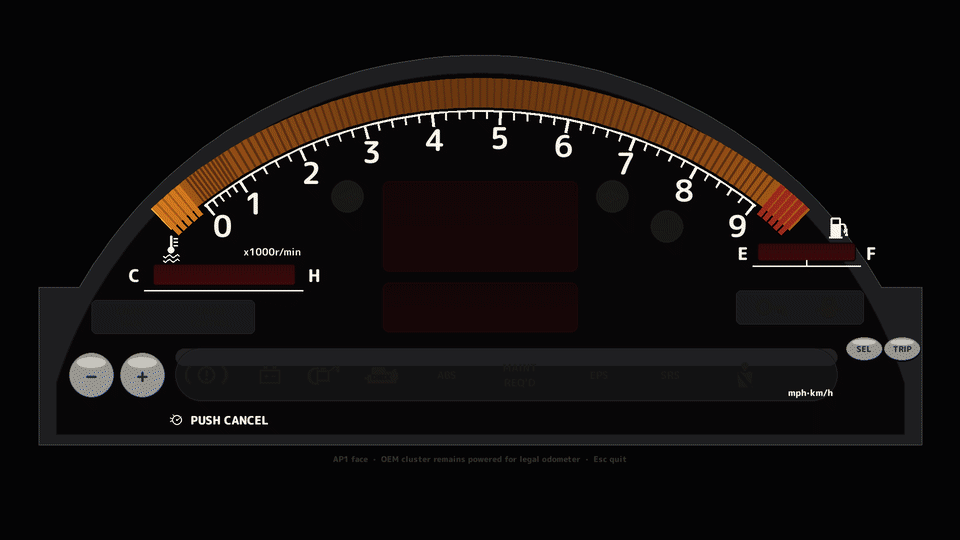
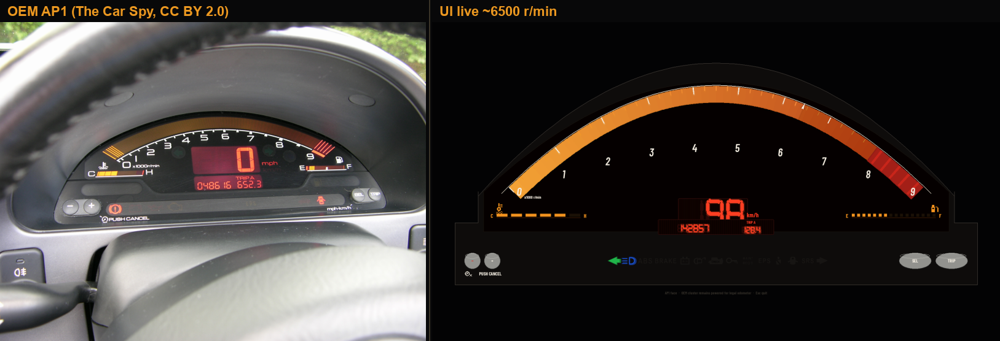
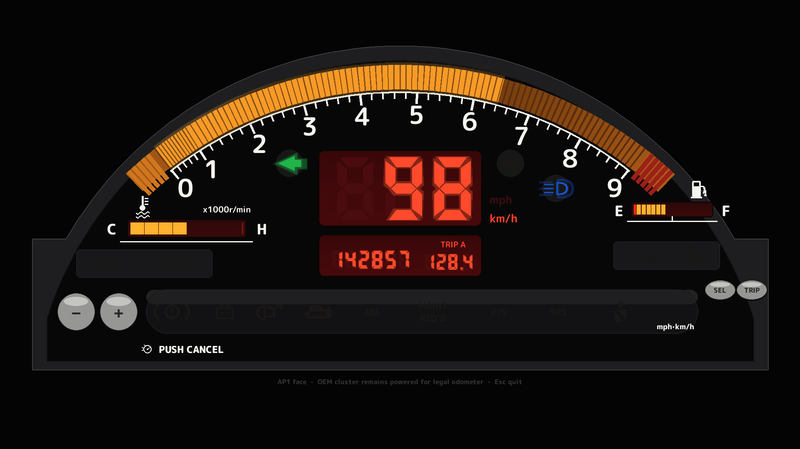
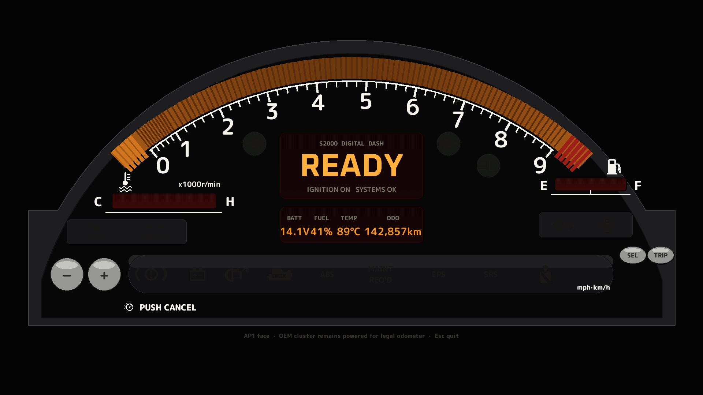
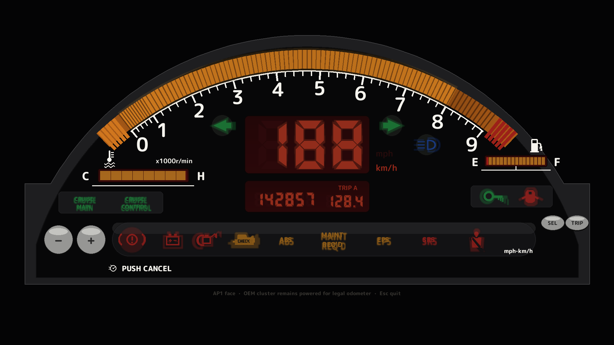
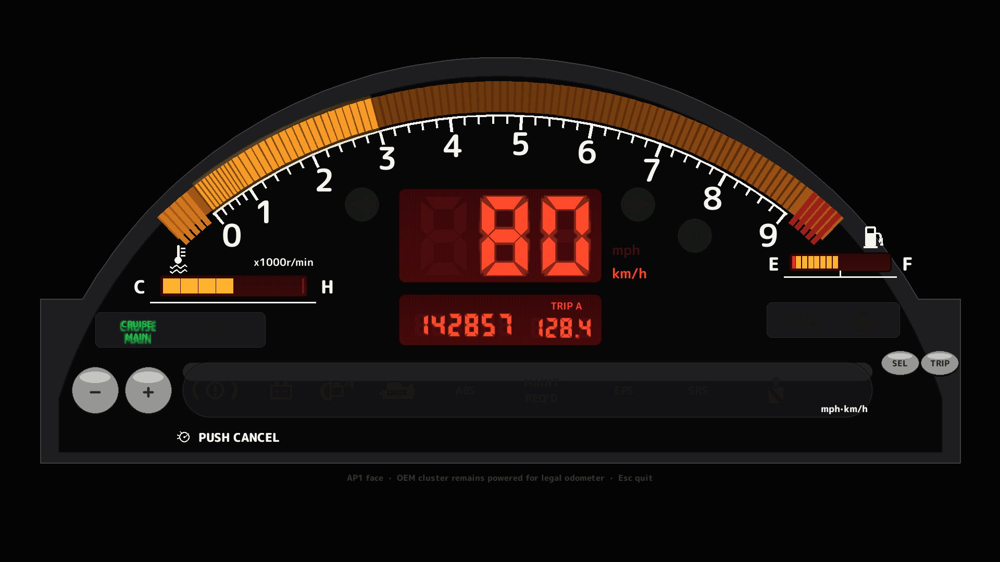
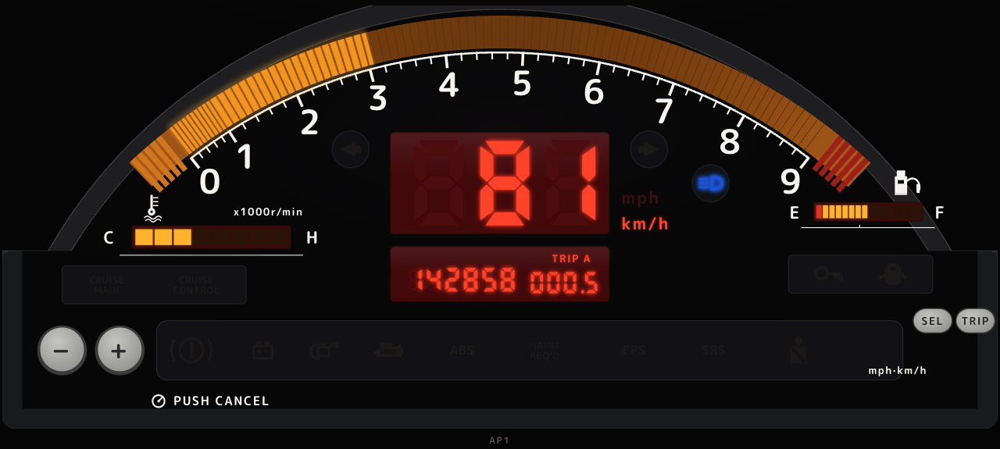

<h1 align="center">
  
  S2000 Digital Dash
</h1>

<p align="center">
  <a href="https://github.com/johnnyhuy/s2000-digital-dash/actions/workflows/ci.yml"></a>
  
  
  
  
  
</p>

> **Unofficial enthusiast / DIY project.** This repository is **not affiliated with, endorsed by, or associated with Honda Motor Co., Ltd.** Honda, S2000, AP1, AP2, and related marks are trademarks of their respective owners. For **personal and educational use** on the bench. The on-screen odometer is **display-only** — the **OEM cluster must stay plugged** so the factory odometer remains the legal one.

<p align="center">
  <strong>Newline JSON in. Selectable AP1 / AP2 face styles out.</strong><br/>
  Phase 1 bench mock for a Raspberry Pi 5 + Wisecoco-class 7&quot; AMOLED overlay.<br/>
  Not a product, not car-ready, not a replacement for the factory cluster.
</p>

<p align="center">
  
</p>

<p align="center">
  <sub>Hero is a baked 30 fps intro→live loop (60 fps VP9). Stills are in <a href="shots/"><code>shots/</code></a>. OEM vs UI composites live in <a href="docs/assets/compare/"><code>docs/assets/compare/</code></a>.</sub>
</p>

<p align="center">
  
</p>
<p align="center">
  <sub>Left: OEM AP1 cluster, <a href="https://www.flickr.com/photos/thecarspy/2644733191/">The Car Spy</a> (<a href="https://creativecommons.org/licenses/by/2.0/">CC BY 2.0</a>). Right: this UI. Sources in <a href="refs/oem/SOURCES.md"><code>refs/oem/SOURCES.md</code></a>.</sub>
</p>

## Features

<table>
<tr>
<td width="50%" valign="middle">

### Face styles (AP1 default, AP2 selectable)

Red 7-seg speed/odo on an **amber tach** in a hooded arched cowl. Flat 2.35:1 elevation — no fake 3D skew.

- **AP1** (default): **horizontal TEMP left / FUEL right** block bars flanking the speed/odo. Tach is the OEM **amber bar graph on a true circular arc** — cells light in 100 rpm steps, red hatch past 9, no needle. Every anchor comes from one measured lock, [`src/face_spec.py`](src/face_spec.py), explained in [`refs/flat/DIMENSIONS.md`](refs/flat/DIMENSIONS.md) and shared with the web harness and the CAD.
- **AP2**: interpretive stacked arched TEMP / FUEL on the right, plus a clock row. Uses [`refs/oem/ap2/`](refs/oem/ap2/) as reference — **not** a pixel-perfect plate.

Toggle in the [web harness](apps/harness/) or `python src/gauge_ui.py --style ap2` (keys `1` / `2` live). Protocol fields stay frozen.

Arched tach **0–9 ×1000**, five redline blocks **8–9**, digital speed, **ODO / TRIP A**. Bottom strip uses OEM telltales: red BRAKE / battery / oil / door / seatbelt / SRS, amber ABS / CEL / MAINT / EPS, green immobilizer + turn arrows, blue high beam.

</td>
<td width="50%">
  
</td>
</tr>
<tr>
<td width="50%" valign="middle">

### ID.4-style boot

Skippable with Space or `--no-intro` (web harness: Space or **Skip boot**):

1. Welcome light sweep along the cowl
2. **READY** summary (batt / fuel / temp / odo)
3. Gauge reveal (tach self-test + lamp bulb-check)
4. Live

</td>
<td width="50%">
  
</td>
</tr>
<tr>
<td width="50%" valign="middle">

### Frozen JSON pipe

One object per line. Field names stay **`rpm`**, **`speed_kmh`**, **`fuel_pct`**, **`ect_c`**, **`batt_v`**, **`odo_km`**, optional **`lamps`**.

Phase 1: `mock_telemetry.py` at 20 Hz. Phase 2: the same schema over UART (`--serial`).

</td>
<td width="50%">
  
</td>
</tr>
<tr>
<td width="50%" valign="middle">

### Overlay path

The factory cluster stays powered. This UI is an overlay so the **legal odometer** keeps counting on the OEM unit.

Phase 1 is **wall power** on the bench — no ESP32, no car taps. Phase 2 will add high-Z taps later.

</td>
<td width="50%">
  
</td>
</tr>
<tr>
<td width="50%" valign="middle">

### Placeholder CAD

OpenSCAD in [`cad/`](cad/): overlay 7" bezel + generic connector shells, and an Option 1 **replace-face** stack in [`cad/replace_face/`](cad/replace_face/). **Not** AP1-accurate. Bay **callipers required** before any cabin print. **PETG or ASA — not PLA.**

</td>
<td width="50%">
  
</td>
</tr>
</table>

---

## Install

Python **3.11+**. Prefer **[uv](https://docs.astral.sh/uv/)** (`pyproject.toml` + `uv.lock`). Dummy SDL is enough for tests and screenshots; a real display is only needed for the fullscreen Pi session.

```bash
git clone https://github.com/johnnyhuy/s2000-digital-dash.git
cd s2000-digital-dash
uv sync
```

Dev extras (pytest, pyserial for UART mocks):

```bash
uv sync --extra dev
```

`requirements.txt` / `requirements-dev.txt` stay as pip mirrors. On the Pi, `export DISPLAY=:0` if the box boots headless to a desktop session.

## Web cluster harness (no Pi)

Shareable Next.js demo of the same face, drawn as one SVG straight from the exported lock (`apps/harness/lib/faceSpec.json`) — red mitred 7-seg, amber bar-graph tach, side block bars, telltale strip and buttons all share pygame's numbers. Client-side mock loop (play/pause, **AP1 / AP2** face, idle / cruise / VTEC / warn) and the same sweep → READY → reveal boot as the Pi UI. Cluster type is self-hosted M PLUS Rounded 1c; telltales are inline ISO pictograms.

<p align="center">
  
</p>
<p align="center">
  <sub>Web AP1 cruise. Warn and AP2 stills: <a href="docs/assets/web-ap1-warn.png"><code>web-ap1-warn.png</code></a>, <a href="docs/assets/web-ap2-warn.png"><code>web-ap2-warn.png</code></a>.</sub>
</p>

```bash
cd apps/harness
npm install
npm run dev    # http://localhost:3000  (also /harness)
npm run build
```

**Vercel:** create a project with **Root Directory** `apps/harness` (Next.js preset). See [`apps/harness/README.md`](apps/harness/README.md).

The banner on that page is the same **unofficial DIY / not Honda Motor Co.** disclaimer as this README.

## Run

```bash
# Bench mock pipe (repo root)
uv run python src/mock_telemetry.py | uv run python src/gauge_ui.py

# Same thing from src/
cd src && python mock_telemetry.py | python gauge_ui.py
```

Fullscreen by default. Esc or Q quits.

| Flag | What it does |
| --- | --- |
| `--windowed` | 1920×1080 window instead of fullscreen |
| `--intro` / `--no-intro` | Force or skip the boot sequence (intro is on unless `--smoke`) |
| `--smoke` | Dummy SDL, draw a few frames, exit (CI / Pi check; no live pipe needed) |
| `--screenshot DIR` | Write `01_sweep.png` … `05_cruise.png` into DIR |
| `--serial [PORT]` | Phase 2 UART stub (needs `pyserial`; default `/dev/ttyUSB0`) |
| `--style ap1\|ap2` | Face layout. **ap1** (default) horizontal TEMP/FUEL flanking the speedo; **ap2** arched side gauges |

```bash
# Fast health check (same commands CI runs)
uv sync --extra dev
uv run pytest
SDL_VIDEODRIVER=dummy uv run python src/gauge_ui.py --smoke
uv run python -m mocks.esp32_uart --count 25 --immediate | uv run python src/gauge_ui.py --smoke
uv run python scripts/ui_harness.py --check

# Rebuild stills
uv run python src/gauge_ui.py --smoke --screenshot shots

# OEM | UI side-by-sides
uv run python scripts/compare_oem.py

# Rebuild stills + 30 fps intro GIF / 60 fps VP9 (needs ffmpeg)
uv run python scripts/bake_showcase.py
```

Stdin is newline JSON. Phase 2 UART is the same schema on `--serial`.

## Mocked environments (no hardware)

Pi UI and a future ESP32 source can be exercised in isolation. Field names stay frozen.

```bash
# Headless Pi cluster (dummy SDL — CI / no display)
SDL_VIDEODRIVER=dummy uv run python src/gauge_ui.py --smoke --screenshot /tmp/shots

# Existing bench pipe (mock drive loop → UI)
uv run python src/mock_telemetry.py | uv run python src/gauge_ui.py --windowed

# Mock ESP32 UART emitter → stdout @ 20 Hz (same newline JSON as Phase 2)
uv run python -m mocks.esp32_uart
uv run python -m mocks.esp32_uart --count 40 --immediate --scenario warn

# Mock ESP32 → headless UI (no Pi, no ESP32, no car)
uv run python -m mocks.esp32_uart --count 40 --immediate | uv run python src/gauge_ui.py --smoke --screenshot /tmp/e2e

# Local PTY stand-in for --serial (prints PTY=/dev/pts/N)
uv run python -m mocks.esp32_uart --pty --count 40 --immediate
# then, in another shell: uv run python src/gauge_ui.py --serial /dev/pts/N
```

`mocks/esp32_uart.py` is a Python stand-in, not flashed firmware. Scenarios: `drive` (cruise loop + OEM extra lamp keys off), `warn` (low fuel / hot ECT / every telltale), `idle`.

## Protocol

See [`src/protocol.py`](src/protocol.py). **Do not rename fields.**

Required: `rpm`, `speed_kmh`, `fuel_pct`, `ect_c`, `batt_v`, `odo_km`

Optional: `lamps` object (`oil`, `cel`, `abs`, `turn_l`, `turn_r`, `high_beam`, `fog`, `fuel_low`, `batt_warn`, `ect_hot`, …)

## Layout

- `src/protocol.py` — shared schema + parse/validate
- `src/mock_telemetry.py` — 20 Hz fake drive loop → stdout (Pi bench pipe)
- `src/face_style.py` — `ap1` / `ap2` face enum (layout only)
- `src/face_spec.py` — **the face lock**: AP1/AP2 arc geometry, windows, lamps, buttons; exports `faceSpec.json` + `face_lock.scad`
- `src/gauge_ui.py` — pygame 1920×1080 cluster + intro + `--style`, drawn from the lock
- `src/lcd_digits.py` — OEM mitred 7-segment speed / odo with ghost + bloom
- `scripts/measure_oem_ui.py` — perspective-corrected landmark / circle-fit measurement of the OEM photo
- `src/serial_reader.py` — Phase 2 UART stub + `SerialLineReader` (pyserial optional)
- `mocks/` — mock ESP32 UART emitter + in-memory / PTY serial (no firmware)
- `tests/` — pytest (unittest + harness ahash + e2e pipe)
- `refs/flat/` — `DIMENSIONS.md` (arc lock explained) + historic flat SVG
- `refs/oem/` — curated AP1 photos + labelled AP2 reference (caution: not a plate) + `SOURCES.md`
- `assets/icons/` — OEM telltale SVG/PNG atlas (tinted at draw time)
- `cad/` — OpenSCAD placeholders (overlay bezel + connectors + `replace_face/`). PETG/ASA notes stay here.
- `shots/` — sweep / ready / reveal / live / cruise stills
- `docs/assets/` — unofficial geometric H, intro GIF, VP9 hero, OEM|UI compares
- `scripts/bake_showcase.py` — regenerate stills + 30 fps hero
- `scripts/ui_harness.py` — screenshot / ahash harness
- `scripts/compare_oem.py` — OEM photo | UI composites
- `pyproject.toml` + `uv.lock` — uv project
- `apps/harness/` — Next.js App Router web cluster (Vercel; Root Directory `apps/harness`)
- `.github/workflows/ci.yml` — uv pytest + pygame smoke/e2e + web harness build on push/PR to `main`

## CAD placeholders

See [`cad/README.md`](cad/README.md). Overlay 7" bezel + connector shells are dimensional guesses for a wall-powered bench (Pi 5 + 7" AMOLED). Option 1 (full arched face replace) lives in [`cad/replace_face/`](cad/replace_face/): the mask's display windows and the hood crown are generated from the same `face_spec.py` lock as the UI, and the tray carries a parametric 7" panel pocket. None of this is a Honda drop-in.

- Callipers required before any cabin print
- Print **PETG or ASA**, never PLA in a sun-soaked dash
- `bash cad/replace_face/export.sh` regenerates `face_lock.scad` → `stl/` → cleaned `print/{stl,obj,step}` + `preview/assembly.glb` (OpenSCAD + `uv --extra cad`, no Blender)

## Disclaimer

This is an **unofficial** enthusiast / DIY bench project.

- **Not affiliated with, endorsed by, or associated with Honda Motor Co., Ltd.**
- Honda, S2000, AP1, AP2, and related names are trademarks of their respective owners
- Personal / educational use only
- The overlay odometer is **display-only**. Keep the **OEM cluster plugged** for the legal odometer
- Phase 1 is not vehicle wiring. Do not treat placeholder CAD as production geometry
- The title icon is an original geometric **H**, not Honda Motor Co. trademark artwork

## Community

Bench notes and Phase 2 tap ideas belong in [Issues](https://github.com/johnnyhuy/s2000-digital-dash/issues). Keep protocol field names stable so mock, UI, and a future UART source stay interchangeable.

This is a small overlay experiment, not a product landing page. If the **AP1** face geometry drifts, the lock file in `refs/flat/` wins. AP2 is a separate interpretive layout.

## Repository name

The live GitHub repo is [`johnnyhuy/s2000-digital-dash`](https://github.com/johnnyhuy/s2000-digital-dash) (renamed from `s2000-ap1-digital-dash`; old URLs redirect).

Historical AP1 paths (`refs/flat/ap1_*`, `refs/oem/lit/lit_ap1_*`, `docs/assets/compare/compare_ap1_*`) stay. They are AP1-specific and labelled as such.
