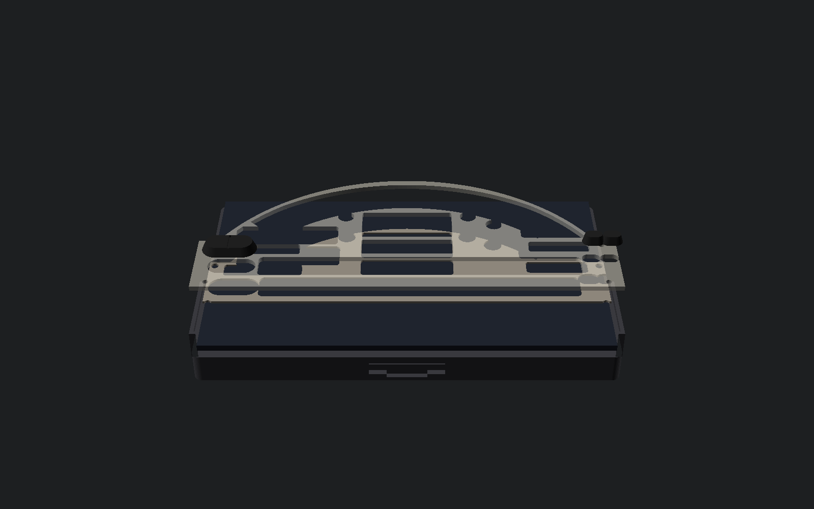

# Option 1 — replace-face printable stack (arc lock)

**This is not a verified AP1 drop-in.** Do not print these parts for the
car until you have measured the cluster bay **and** the OEM face with
callipers. Every critical size in the SCAD is marked `PLACEHOLDER` or
`TODO measure`. The millimetre envelope (170 × 72.3 mm, 2.35:1) is
**ESTIMATED** from [`refs/flat/DIMENSIONS.md`](../../refs/flat/DIMENSIONS.md).


## One lock, three renderers

The face geometry is **not** typed into the SCAD. `src/face_spec.py` is the
single source of truth for the AP1 / AP2 face (tach arc centre + radii,
hood crown, LCD windows, side bars, telltale spots, buttons). It exports:

| Output | Consumer |
| --- | --- |
| `apps/harness/lib/faceSpec.json` | Next.js SVG harness |
| `cad/replace_face/face_lock.scad` | this stack (`dims.scad` includes it) |
| in-process | pygame (`src/gauge_ui.py`) |

So the pixels the panel shows and the holes the mask cuts come from the
same numbers. To move anything: edit `face_spec.py`, then
`bash cad/replace_face/export.sh`.

`face_lock.scad` is in top-left fractions (x / w / radii of module width,
y / h of module height). `dims.scad` converts to millimetres and flips to
y-up with `X() Y() W() H()`; arc maths uses `tach_pt()` / `crown_pt()`.

## How the digital face maps onto the OEM plate

The OEM face is a printed plate over a segment LCD. Here the whole face is
drawn by a **7" 16:9 AMOLED** (Wisecoco-class, ~164 × 100 module, ~154 × 87
active — PLACEHOLDER) and the mask only leaves **windows** where the OEM
face had backlit or printed-on-glass content:

- one **annular sector** from just outside the bar-graph band to just
  inside the numerals (band, ticks, 0–9, hatch overrun) — the panel draws
  the amber bar graph exactly as `gauge_ui.py` does
- **speed** and **odo / trip** LCD windows
- **TEMP** and **FUEL** block bars with their icons and C/H · E/F letters
- three round **arc telltales** (turn L/R, high beam)
- the **telltale strip** and the two lower **panels**
- button holes and four (fictional) alignment holes

Every window is clipped to the hood inset by `min_rim` so the mask keeps a
rim where the band runs under the crown lip. PUSH CANCEL, mph·km/h and
the cowl stay printed on the plate, as on the OEM.

The panel's active area is centred on the module: it is **taller** than
the face (87 vs 72.3) and **narrower** (154 vs 170). Every display window
falls inside it. The −/+ rocker and SEL / TRIP ovals sit over the panel's
dead border, so their switch wells are **skipped** in the tray
(`point_in_rect` check) until a real panel drawing says where a switch can
go. That is an open problem, not a solved one.

## What you get

Each printable is **one solid**.

| File | Part | Material |
| --- | --- | --- |
| `backlight.scad` → `backlight.stl` | Tray: hood silhouette + panel envelope, face rebate, 7" pocket, board cavity, FPC / cable notches | PETG / ASA |
| `backlight_web.scad` → `backlight_web.stl` | 0.9 mm light-baffle web between panel glass and mask | PETG / ASA |
| `acrylic_face.scad` → `acrylic_face.stl` | Arched mask with the display windows above | laser acrylic, or PETG / ASA as a tracing template |
| `button_rocker.scad` → `button_rocker.stl` | −/+ PUSH CANCEL rocker (no stem — switch UNKNOWN) | TPU / silicone |
| `button_sel.scad`, `button_trip.scad` | SEL / TRIP ovals | TPU / silicone |

Preview only (never export as a printable): `assembly.scad` (exploded
stack, F5; `-D print_placement=true` echoes part offsets),
`rubber_buttons.scad` (three buttons on one plate).

Shared maths: `face_lock.scad` (generated), `dims.scad` (mm + stack),
`outline.scad` (2D silhouette + windows), `parts.scad` (3D solids).



## Regenerate

```bash
bash cad/replace_face/export.sh            # lock → STL → print/ + preview/
uv run --extra cad python cad/replace_face/mesh_export.py --explode 0
```

`export.sh` runs `face_spec.py`, one OpenSCAD export per part into
`stl/` (raw CGAL dumps, one body each), then `mesh_export.py` (trimesh,
no Blender): merge / degenerate / winding clean, refuses anything not
watertight, writes `print/stl`, `print/obj`, faceted `print/step`
(honest tessellation — not a B-rep rebuild) and the coloured exploded
`preview/assembly.glb`. Needs OpenSCAD on `PATH` (`brew install --cask
openscad@snapshot` on macOS) and `uv`.

## Stack (front → rear)

1. **Rubber buttons** — TPU 95A or cast silicone.
2. **Mask** — 2 mm PLACEHOLDER. Black / smoked acrylic for real, PETG / ASA
   print as a template.
3. **Baffle web** — `web_t` 1.0 mm gap, 0.9 mm part. Layout only, not optics.
4. **7" AMOLED** — bought module in the tray pocket, glass toward the mask.
   `panel_*` in `dims.scad` are PLACEHOLDER; check the vendor drawing.
5. **Tray** — floor, rim, board cavity under the panel. Outer rim is
   `offset(wall)` around the hood + panel envelope — a print wall, **not** a
   measured bay clip.
6. **Switches under the buttons** — not modelled (see the open problem above).

| Part | Use | Do not use |
| --- | --- | --- |
| Tray, web, printed mask proxy | **PETG or ASA** | **PLA** — creeps on a sun-soaked dash |
| Buttons | TPU 95A, or silicone from a printed master | PLA |
| Production mask | Cast acrylic (laser) | PLA |

## Measure list (callipers required)

- [ ] OEM face overall width × height × thickness; hood crown radius and spring points
- [ ] Bay opening width × height × depth, lip, corner radius, fastener / clip pattern — **do not drill from this CAD**
- [ ] Glass plane to bay rear; sight line so the stack does not reflect in the windscreen
- [ ] Panel module outline, active area, thickness, FPC exit — replace `panel_*`
- [ ] Rocker, SEL, TRIP centre-to-centre and outline; whether PUSH CANCEL is the rocker push
- [ ] Button travel and the actual switch / encoder, and where it can live beside the panel
- [ ] Mask thickness; alignment pin locations (the four holes here are fiction)

## What this is not

- Not a verified AP1 drop-in, not a factory-harness replica
- Not the overlay-only 7" bezel (`cad/bezel_7in_placeholder.scad`)
- Not optically designed; not a finished cabin part

If the face lock moves, it moves in `src/face_spec.py` — never by hand
in `face_lock.scad` or a mesh.
